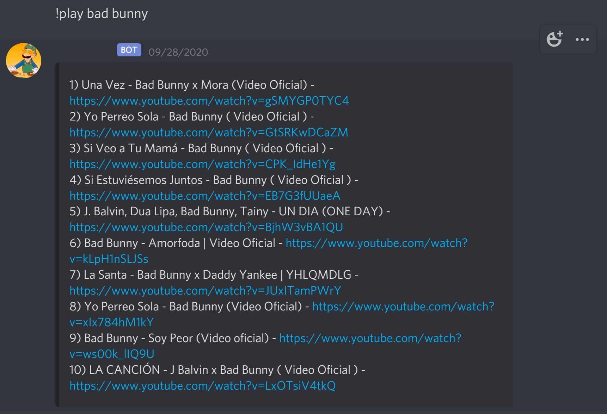
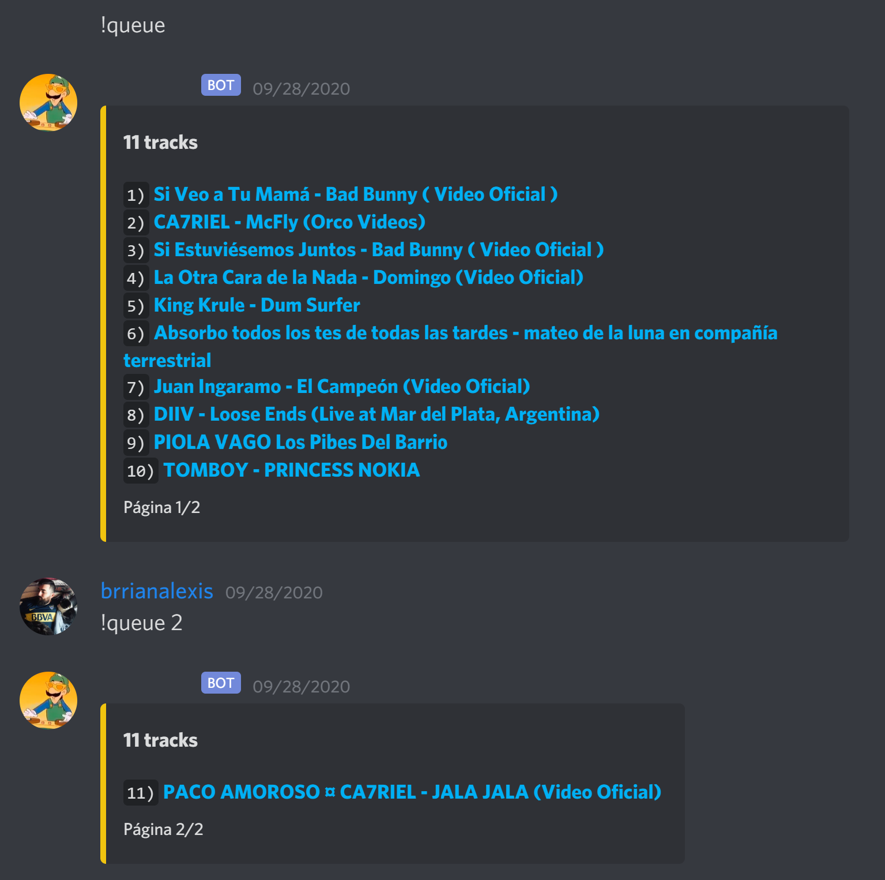
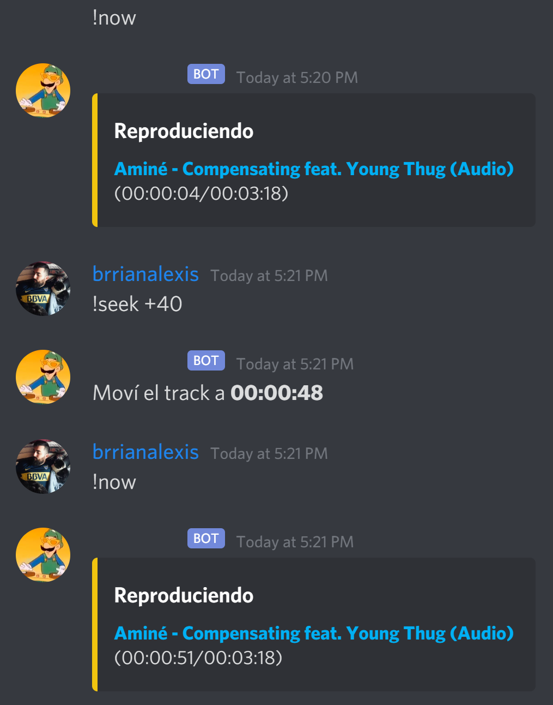

# Discord DJ 🎧🎵

## Prerequisites 📝

- You'll need to create a Discord bot to make this work. To do so, you can follow the `discord.py` docs [here](https://discordpy.readthedocs.io/en/latest/discord.html).

- You'll need [OpenJDK 11](https://openjdk.java.net/projects/jdk/11/) to run Lavalink. The easiest way to get it is by using the binaries provided by [AdoptOpenJDK](https://adoptopenjdk.net/).

- To run the development server using the script provided in the `Pipfile`, you'll need to have [node.js](https://nodejs.org/en/) installed to use it, and then install [nodemon](https://nodemon.io/) globally running `npm i -g nodemon`

- You'll need [pipenv](https://pipenv.pypa.io/en/latest/) installed. Once you clone the repo, navigate to the folder where it was cloned and run `pipenv install`. This will install [discord.py](https://discordpy.readthedocs.io/en/latest/index.html) and [lavalink.py](https://github.com/Devoxin/Lavalink.py) (not to be confused with Lavalink itself).

## Setup 🛠

- You can get the latest Lavalink release [here](https://github.com/Frederikam/Lavalink/releases). Download the `Lavalink.jar` file and place it in the root of the repo.

- Have a look at the **Server configuration** portion of the Lavalink docs [here](https://github.com/Frederikam/Lavalink#server-configuration) and place the `application.yml` file on the root of the repo.

- Finally, create a `.env` file on the root of the repo and add these variables:

```
DJ_TOKEN = Your bot's token
PREFIX = The prefix your commands will use, for example: !
LAVALINK_PASS = The same server password specified on the application.yml file. Following the example provided by Lavalink, it would be: youshallnotpass
```

## Running the bot 🤖

If you take a look at the `Pipfile`, you'll find that there are two scripts. One to start a development server using `nodemon` and another one to run `Lavalink`. To get the bot up and running, you'll need to run Lavalink first and then the development server.

To start `Lavalink` run:

```
pipenv run lavalink
```

To start the development server run:

```
pipenv run dev
```

## Commands provided 🤓

To run any of these, type `<PREFIX><COMMAND>` in the chat. For example: `!join`. Keep in mind that they **are case-sensitive**.

- [join](#join)
- [nv](#nv)
- [play](#play)
- [vol](#vol)
- [stop](#stop)
- [pause](#pause)
- [skip](#skip)
- [queue](#queue)
- [now](#now)
- [seek](#seek)

### **join**

Makes the bot join the voice channel where you are. It is the first command you'll always run once you boot up the bot.

### **nv**

Makes the bot leave the voice channel
> It is named 'nv' because it's a short form for saying 'nos vemos' 🇦🇷 which translates to 'see you later' 🇬🇧. You can change it by modifying `line #35` on `src/cogs/dj.py`

### **play**

Makes the bot search the provided query on `YouTube`. It will respond with the results and a number for each one. You can then respond with the number of the track you want to play or add to the queue. For example:

<div align="center">
  
</div>

### **vol**

Sets the volume, providing an integer from 1 to 100. The bot will reply letting you know the volume was set.

### **stop**

Stops playback.

### **pause**

Pauses or resumes playback.

### **skip**

Skips to the next track. The bot will reply letting you know it skipped a track.

### **queue**

The bot returns the queue paginated every 10 tracks, with the corresponding page number on the footer of the message. If you provide an integer to the command, you can see the page of the queue that corresponds to it. For example:

<div align="center">
  
</div>

### **now**

The bot returns the track that's currently playing.

### **seek**

You can use this command to rewind or fast-forward the current track by providing a minus or plus sign and the amount of seconds you want to rewind or fast-forward. For example:

<div align="center">
  
</div>

### **remove**

You can use it to remove a track from the queue by providing the index related to it as an integer.

### **shuffle**

Toggles shuffle functionality on playback.

### **repeat**

Toggles repeat functionality on playback.

## LICENSE

MIT
